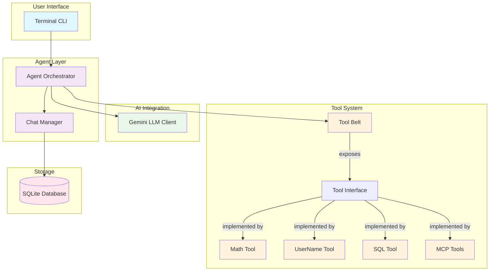
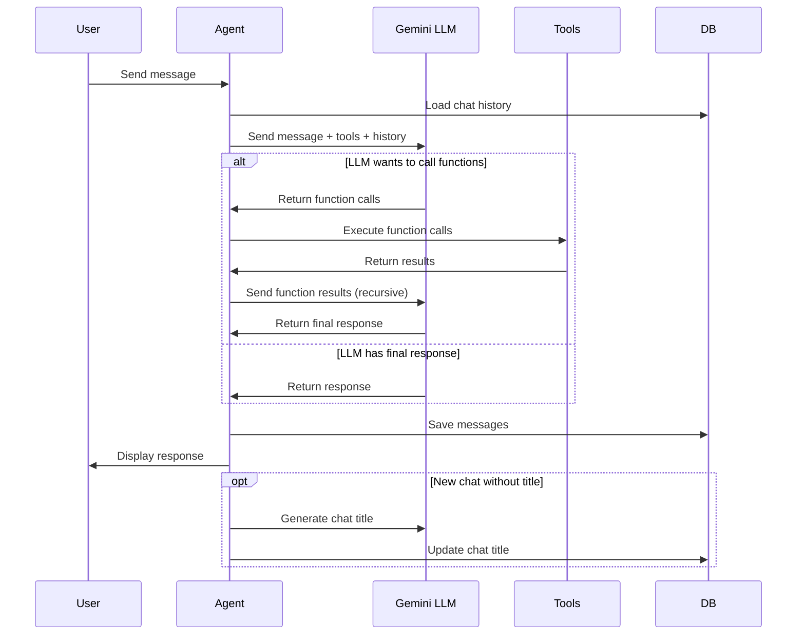
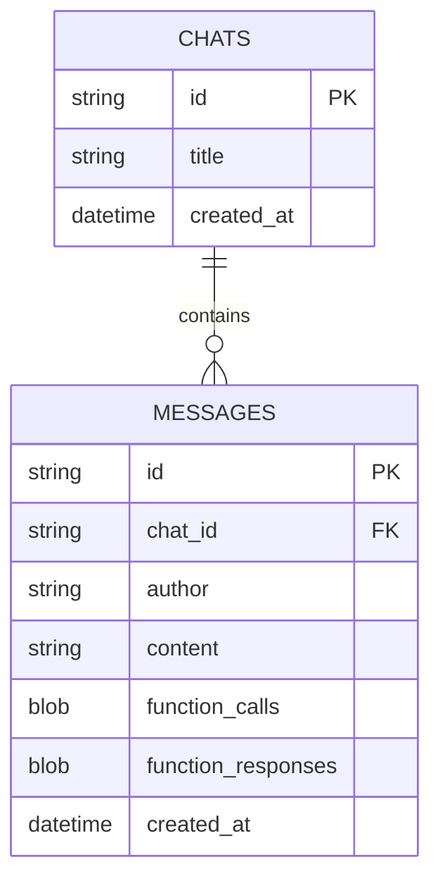

# AI Agent with Tool Calling

A command-line AI agent built in Go that provides an interactive chat interface with tool calling capabilities. This project demonstrates the core components that make an AI agent truly intelligent: conversation persistence, function calling, and extensible tool integration.

## Features

- 🤖 **AI-Powered Chat**: Interactive terminal interface using Google Gemini AI
- 🛠️ **Tool System**: Extensible plugin-based tool architecture
- 💾 **Persistent Conversations**: SQLite-based chat history with automatic titling
- 🔌 **MCP Integration**: Model Context Protocol support for external tool integration
- 📊 **Function Calling**: JSON schema-based function execution with recursive AI interactions

## Architecture Overview

The agent follows a clean layered architecture with well-defined component boundaries:



## System Flow

The agent follows a recursive interaction pattern that enables complex multi-step problem solving:



## Component Details

### Core Components

#### Agent Layer (`agent/`)
- **Agent Orchestrator** (`agent.go`): Main coordination logic between user, LLM, and tools
- **Chat Manager** (`chat/`): Handles conversation state, message serialization, and persistence

#### LLM Integration (`llm/`)
- **Gemini Client** (`gemini.go`): Google Gemini AI integration with function calling support
- Converts between internal message formats and Gemini API schemas
- Handles JSON schema generation for tool function definitions

#### Database Layer (`db/`)
SQLite-based persistence with the following schema:



## Getting Started

### Prerequisites
- Go 1.21 or later
- SQLite3
- Google Gemini API key

### Installation

1. Set up your environment:
```bash
export GEMINI_API_KEY="your-gemini-api-key"
```

2. Run database migrations & agent
```bash
make
```

### Usage

Once started, you can interact with the agent through the terminal:

```
> What's 15 + 27?
[The agent will use the Math tool to calculate: 42]

> What's my username?
[The agent will use the UserName tool to get your system username]

> Show me all my chat history
[The agent will use the SQL tool to query the database]
```

## Available Tools

### Built-in Tools

- **Math Tool**: Basic arithmetic operations (sum, subtract)
- **UserName Tool**: Retrieves the current system username
- **SQL Tool**: Executes read-only database queries for introspection

### MCP Integration

The agent supports Model Context Protocol (MCP) for external tool integration:

- Configuration via `agent.json`
- Dynamic tool discovery
- Currently configured with Linear app integration as example

## Development

### Adding New Tools

1. Create a new file in `tool/` implementing the `Tool` interface:

```go
type MyTool struct{}

var _ Tool = (*MyTool)(nil)

func (t *MyTool) Functions(ctx context.Context) []Function {
    return []Function{
        {
            Name: "my_function",
            Description: "Description of what this function does",
            Parameters: map[string]any{
                "type": "object",
                "properties": map[string]any{
                    "param1": map[string]any{
                        "type": "string",
                        "description": "Parameter description",
                    },
                },
                "required": []string{"param1"},
            },
        },
    }
}

func (t *MyTool) Call(ctx context.Context, function string, args map[string]any) (map[string]any, error) {
    // Implementation here
}
```

2. Register the tool in `cmd/term/main.go`:

```go
toolBelt := tool.NewToolBelt()
toolBelt.AddTool("my_tool", &tool.MyTool{})
```

### Database Operations

Use the provided Makefile commands:

```bash
# Apply migrations
make migrate-up

# Rollback migrations
make migrate-down
```

## Configuration

### Environment Variables
- `GEMINI_API_KEY`: Required for Google Gemini API access

### Database
Configurable via `DB_PATH` environment variable, defaults to `./agent.db`

### MCP Servers
Configure external MCP servers in `agent.json`

## Technical Details

### LLM Model
- Uses `gemini-2.0-flash` model
- 5-second timeout for API calls
- JSON schema-based function calling
